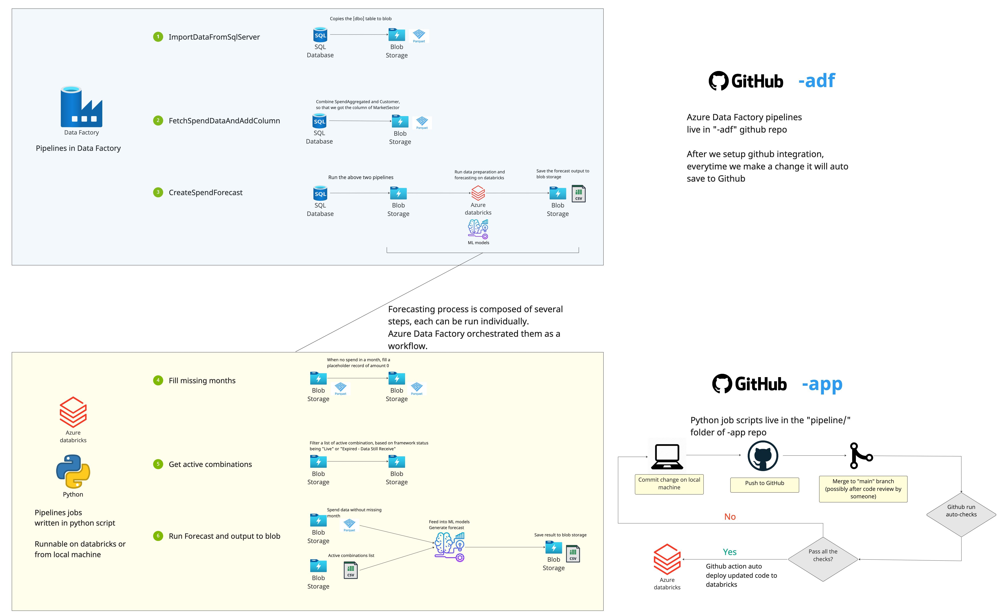

# CCS Spend Forecasting

This is main repo for CCS spend forecasting project.

## About

The goal of this application is to perform financial forecasting for CCS. Currently it does monthly forecast for each
category (aka group) and market sector (aka segment). Though this can be changed to sub-category (aka category) with
subsequent change in data preparation and model training.
In CCS few terms are used interchangeably, below table list those:

| Entity referred in Code | Other Name |
|-------------------------|------------|
| Category                | Group      |
| Sub-Category            | Category   |
| Market Sector           | Segment    |

-------------------------------------------------------
## Requirements

For the local development you need following libraries installed on your local machine:

- Java
- Python
- Poetry


Note: We have used Python version 3.9, so we recommend using that or above.
### Java installation

In order to install Java on a Mac, the easiest way is to use Homebrew. Run `brew install openjdk`, and create a symlink
to allow your machine to locate the JDK:

```
sudo ln -sfn /opt/homebrew/opt/openjdk/libexec/openjdk.jdk /Library/Java/JavaVirtualMachines/openjdk.jdk
```

Alternatively you can also install from https://adoptopenjdk.net

Java version: Any version with Java 8 or above.
### Dependency management

Dependency is managed by [Poetry](https://python-poetry.org)


-------------------------------------------------------
## Usage:

Below are steps describe how to get started on your local development environment. You can develop and run this project
from you local IDE. Below are the steps of how to run it on you local machine.

### Configuration

Below are the steps for configuring project on your local machine:

1. Checkout the project from the git repo.
2. Run `poetry install` to install all required packages
3. Run `poetry run pre-commit install` to ensure that formatting takes place locally on every commit
4. Make a copy of the "file config.ini.template" and rename it to "config.ini".
5. Edit the file "config.ini" and add required details like username and password. **_Never checkin this file in git as
   this is a public repo_**.
6. Create a folder called "logs" at the root of the application that will contain the application logs. Alternatively
   you can edit the "logging.conf" file and edit the line:

   _args=("logs/app.log", 5242880, 3)_.

   There are the arguments as explained below:
    1. Log location: First argument defines the log location. By default, it is a folder call logs and contains log
       files with name app.log.
    2. Log file size: Second parameter describes the size of log file in bytes. By default, it is 5MB.
    3. Number of log files: Third parameter describes number of log files before it is rolled. By default, it is 3.

-------------------------------------------------------
### Exploratory Data Analysis

Below are the steps for running and performing data analysis on your local machine:

1. Explorator data analysis (EDA) is at [data_analysis.py](eda/data_analysis.py). To run EDA you have two options:
    1. Get the data by querying the database: For this you must have credentials and should be able to connect to the
       database. After you get the data you have to insert the missing months i.e. months for which there is no entry.
       This method is **slow** and requires effort.
    2. Get the data file from Azure: The ADF in azure prepares the data needed for the analysis and takes care of adding
       missing months. This data is saved in the parquet format. You can get this file and can perform EDA on this file
       which is much easier. For more information please see:
       1. https://github.com/Crown-Commercial-Service/ccs-spend-forecasting-infra
       2. https://github.com/Crown-Commercial-Service/ccs-spend-forecasting-adf
2. How to run [data_analysis.py](eda/data_analysis.py): We highly recommend to run the code from your favourite IDE as 
   it the easiest way play you get all the benefit of the IDE, however if you wish to run the code from command line use 
   below command:
    ```shell
   export PYTHONPATH=$PYTHONPATH:/Path/to/the/ccs-spend-forecasting-app
   python3 eda/data_analysis.py --local_data_path=/Path/of/the/folder/where/you/saved/the/parquet_files
    ```
   
3. To select a particular category and sector pass the index to the function get_category_sector(index) which contains
   the list of all category sector combination.
4. To run a particular model pass the flag run=True to that function. For example if you want to run SARIMA model:
   ```
    model_sarima(prepared_df, category=category, sector=sector, run=True)
    ```
5. Currently, the best hyperparameters are selected based on lowest AIC score is done to make the process fast. Ideally it 
   should be analysed qualitatively by the data scientist for each category & sector (there are over 150 different 
   combination) before finalising the best value.

-------------------------------------------------------
### Data pipeline

Currently there are totally 6 pipeline jobs in this product. 
3 of them exist in Azure DataFactory `Development-ccs-import-factory`, and the other 3 exist in this repo.
Below is an overview of all pipeline jobs in this product. 



#### Pipeline jobs in Azure DataFactory
For the 3 pipeline jobs in Azure DataFactory, 
The first two `ImportDataFromSqlSqlServer` and `FetchSpendDataAndAddColumn` take cares of pulling data from SQLServer to blob storage. 
The third one `CreateSpendForecast` is a complete end-to-end pipeline forecast workflow of this product, which orchestrates all pipeline activities in this product. It handles all tasks from pulling data from SQL server to saving the forecast result to blob storage.
With the current full data sets (~140 active combinations of Category/MarketSector), it could take > 24 hours to complete a whole pipeline run.

#### Pipeline jobs in this repo
The 3 pipeline jobs in this repo handle more complex data processing and the core machine learning and forecasting process. For this reason, they are coded in python and managed in the `pipeline/jobs` folder in this repo.
Each job can be runned as a separate task to allow granular control and ease development. 
Also, these task are orchestrated in the above said Azure DataFactory pipeline `CreateSpendForecast` as a complete end-to-end workflow.
Detail explanation of each pipeline jobs are provided in the following.

#### Before running pipeline jobs in this repo
If you are running the jobs on a local machine, ensure that you fill in blob account_name and blob access_key in file `config.ini`. Also, run the command `az login` beforehead to authenticate yourself with azure cloud.

If you are running the jobs on Azure cloud environment, ensure infrastructures in repo `Crown-Commercial-Service/ccs-spend-forecasting-infra` and `Crown-Commercial-Service/ccs-spend-forecasting-adf` are properly setup already.

Currently, we use the blob storage account `developmentstorageccs` and container `azp-uks-spend-forecasting-development-transformed` for all pipeline jobs. 
Pipeline jobs will try to retrieve necessary data from said blob storage container, and will save any output to there as well.
This setting can be changed by providing different setting in `config.ini`, or editing the default fallback settings in `pipeline/utils.py`.


#### 1. Fill missing months to spend data
Related files: [`pipeline/jobs/fill_missing_months.py`]

This job insert dummy records of amount £0 spending into spend data for in-between months that has no spending.

For every Category/Market sector combinations, it will find the earliest and most recent dates of spend record, and within the period if there is any month that doesn't have any record, it will insert a dummy record with amount zero.

This jobs requires the `TransformedSpendData` data file in blob storage, which is generated by a pipeline job in Azure Data Factory.
The output is stored on blob storage in folder  `SpendDataFilledMissingMonth`.

##### To run this job on a local machine:
```shell
make pipeline_fill_missing_months
```

##### To run this job from Azure:
Use Azure Data Factory to execute the python file `dbfs:/pipeline/main.py` on databricks.

#### 2. Get active combinations

Related files: [`pipeline/jobs/get_active_combinations.py`]

This job generate a list of active Category / MarketSector combinations base on spend data and Framework status.

It finds all frameworks of Status `Live` or `Expired - Data Still Received`, then from the spend data find all Category / MarketSector combinations that are related to such frameworks. Finally it returns a list of Category / MarketSector combination.


This jobs requires the 
`Customers`, `FrameworkCategoryPillar`, `SpendAggregated` data file in blob storage, which are pulled from the tables under the same name in SQL Server.
There is a pipeline job in Azure Data Factory to pull those file from SQL server to blob storage.
The output is stored on blob storage in folder `ActiveCombinations`.

##### To run this job on a local machine:
```shell
make pipeline_get_active_combinations
```

##### To run this job from Azure:
Use Azure Data Factory to execute the python file `dbfs:/pipeline/jobs/get_active_combinations.py` on databricks.


#### 3. Run forecast and output to blob

Related files: [`pipeline/jobs/run_forecast_and_output_to_blob.py`]

This job generate future spend forecast for the future base on spend data.

Currently it works with the forecast model ARIMA, SARIMA and Prophet.
It pulls data from the blob storage, generate forecast with all models and output the forecast to blob storage as .csv file. It also make a comparison based on past data to check which model was more accurate for each Category/MarketSector combination.

Note: For the moment, the period of forecasting is hardcoded to be 26 months starting from 2022-12-01. (calendar month)
This is to allow comparison with EDA code.
This behaviour can be changed easily in the related python file, by adjusting the argument of method call `run_forecast_with_all_models`.

This jobs requires the `SpendDataFilledMissingMonth` and  `ActiveCombinations` data file in blob storage, which is generated by the jobs above.
The output is stored on blob storage in folder `ForecastOutput`.

##### To run this job on a local machine:
```shell
make pipeline_run_forecast
```

##### To run this job from Azure:
Use Azure Data Factory to execute the python file `dbfs:/pipeline/jobs/run_forecast_and_output_to_blob.py` on databricks.


-------------------------------------------------------

### Testing
The unit test of this repo is located in `test` directory. You can use the below command in a terminal to run the full test suite:

```shell
make unit_testing
```